# Chapter 3 Linear Regression

原书地址：[An Introduction to Statistical Learning: with Applications in R](http://www-bcf.usc.edu/~gareth/ISL/)

## 3.1 简单线性回归

$$Y\approx\beta_0+\beta_1X$$
$$\hat{y}=\hat{\beta_0}+\hat{\beta_1}x$$

### 3.1.1 估计系数
最小二乘估计。
### 3.1.2 评估系数估计准确性
标准误差(standard error, $SE(\hat{\mu})$)，可用于计算置信区间。
### 3.1.3评价模型准确性
残差标准误RSE、$R^2$。

## 3.2 多元线性回归
多个预测变量。

## 3.3 注意事项

### 3.3.1 定性预测变量
哑元化。
### 3.3.2 线性模型扩展
- 去除可加性假设：添加交互项。  
- 非线性关系：多项式回归。

### 3.3.3 潜在的问题
#### 1. 数据的非线性
可通过残差图判断，如存在规律，比如U型，提示数据非线性。简单解决方法是在模型中使用预测变量的非线性变换，例如$\log{X}$，$\sqrt{X}$和$X^2$。
#### 2. 误差项自相关
如时间序列数据，可通过绘制时间函数的残差，如果不相关，图中没有明显规律，如果相关，相邻残差可能有类似值。
#### 3. 误差项方差非恒定
如残差图漏斗形（喇叭形），误差性方差随响应值的增加而增加。解决方案：使用凹函数对响应值*y*进行变换，如$\log{y}和\sqrt{y}$。有时估计每个响应值的方差，用加权最小二乘法拟合模型，即权重与方差的倒数成反比例。
#### 4. 离群点
指$y_i$远离模型预测值的点。可通过残差图识别，通常的血生化残差在-3到3之间。
#### 5. 高杠杆点
观测点$x_i$是异常。往往对回归直线的估计有很大的影响。在多远回归中，可通过计算杠杆统计量来判断。
#### 6. 共线性
计算方差膨胀因子VIF。可从回归中提出一个变量，或把共线性变量组合成一个单一的预测变量。
$$VIF(\hat{\beta_j})=\frac{1}{1-R_{X_j\,|\, X_{-j}}^2}$$

## 3.4 营销计划

### （1）广告预算和销量有关吗？


```R
# loading packages
library("ggplot2")
library("magrittr")
```


```R
# read data
advdf <- read.csv('Advertising.csv')
head(advdf)
```


<table>
<thead><tr><th scope=col>X</th><th scope=col>TV</th><th scope=col>radio</th><th scope=col>newspaper</th><th scope=col>sales</th></tr></thead>
<tbody>
	<tr><td>1    </td><td>230.1</td><td>37.8 </td><td>69.2 </td><td>22.1 </td></tr>
	<tr><td>2    </td><td> 44.5</td><td>39.3 </td><td>45.1 </td><td>10.4 </td></tr>
	<tr><td>3    </td><td> 17.2</td><td>45.9 </td><td>69.3 </td><td> 9.3 </td></tr>
	<tr><td>4    </td><td>151.5</td><td>41.3 </td><td>58.5 </td><td>18.5 </td></tr>
	<tr><td>5    </td><td>180.8</td><td>10.8 </td><td>58.4 </td><td>12.9 </td></tr>
	<tr><td>6    </td><td>  8.7</td><td>48.9 </td><td>75.0 </td><td> 7.2 </td></tr>
</tbody>
</table>


#### TV广告投入对销量影响


```R
# TV, sales散点图
advdf %>% 
  ggplot(aes(TV, sales)) +
  geom_point()
```


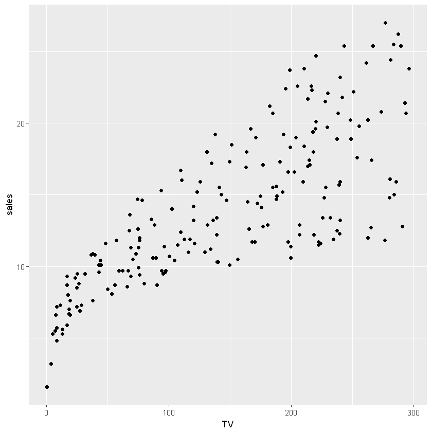


#### 多重线性回归


```R
fit <- lm(sales ~ TV + radio + newspaper, data = advdf)
summary(fit)
```


    
    Call:
    lm(formula = sales ~ TV + radio + newspaper, data = advdf)
    
    Residuals:
        Min      1Q  Median      3Q     Max 
    -8.8277 -0.8908  0.2418  1.1893  2.8292 
    
    Coefficients:
                 Estimate Std. Error t value Pr(>|t|)    
    (Intercept)  2.938889   0.311908   9.422   <2e-16 ***
    TV           0.045765   0.001395  32.809   <2e-16 ***
    radio        0.188530   0.008611  21.893   <2e-16 ***
    newspaper   -0.001037   0.005871  -0.177     0.86    
    ---
    Signif. codes:  0 '***' 0.001 '**' 0.01 '*' 0.05 '.' 0.1 ' ' 1
    
    Residual standard error: 1.686 on 196 degrees of freedom
    Multiple R-squared:  0.8972,	Adjusted R-squared:  0.8956 
    F-statistic: 570.3 on 3 and 196 DF,  p-value: < 2.2e-16
    


- F = 570，P<0.05，广告投入和销量存在相关性。

#### （2）广告预算和销售间的关系有多强？
- $RSE=1.686$，响应变量的平均值为14.0225, 误差百分比约为12%。
- $R^2=0.89$

#### （3）哪种媒体能促进销售
TV、radio
#### （4）计算参数估计得置信区间
TV: $0.045765 \,(0.045765 \pm 1.96 \times 0.001395)$，其他同理。


```R
# 参数估计置信区间
confint(fit)
```


<table>
<thead><tr><th></th><th scope=col>2.5 %</th><th scope=col>97.5 %</th></tr></thead>
<tbody>
	<tr><th scope=row>(Intercept)</th><td> 2.32376228</td><td>3.55401646 </td></tr>
	<tr><th scope=row>TV</th><td> 0.04301371</td><td>0.04851558 </td></tr>
	<tr><th scope=row>radio</th><td> 0.17154745</td><td>0.20551259 </td></tr>
	<tr><th scope=row>newspaper</th><td>-0.01261595</td><td>0.01054097 </td></tr>
</tbody>
</table>


#### （5）对未来销售的预测精度如何？
想预测单个响应值，可使用预测区间；预测平均响应$f(X)$，使用置信区间。预测区间比置信区间宽，因为预测区间解释了$\epsilon$的不确定性，是不可约误差。
#### （6）这种关系是否是线性
可用残差图识别非线性，如下图所示，U型残差图，提示存在非线性效应。


```R
par(mfrow = c(2, 2))
plot(fit)
```


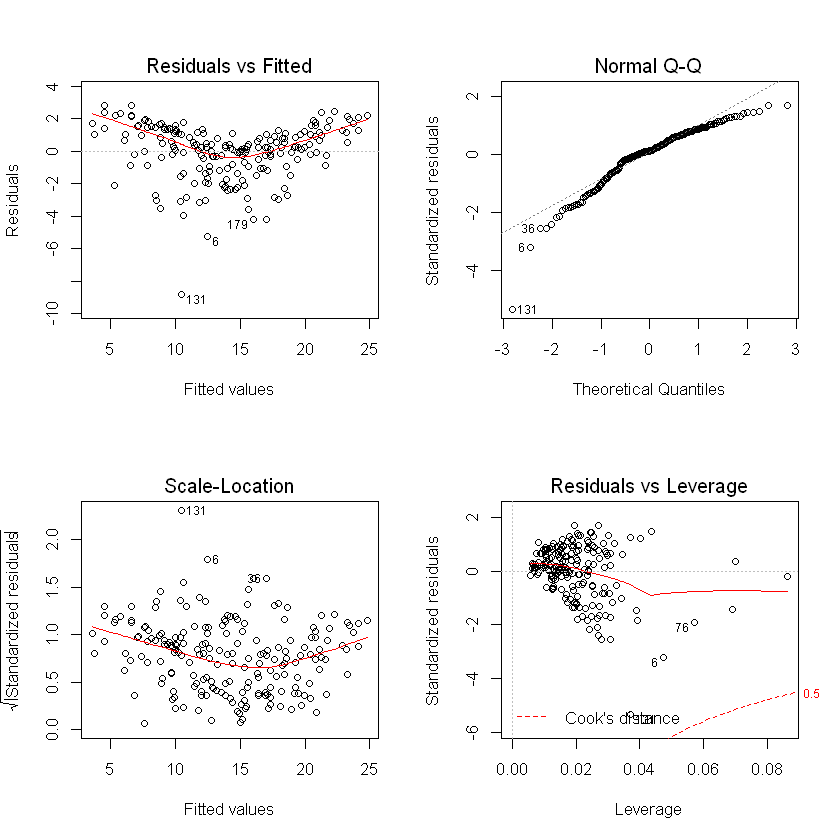


#### （7）广告媒体间是否存在协同效应？
标准线性回归模型预测变量和响应变量是可加的，即每个预测变量对响应变量的影响与其他预测变量无关。拟合交互项模型。


```R
fit2 <- lm(sales ~ TV + radio + TV : radio, data = advdf)
summary(fit2)
```


    
    Call:
    lm(formula = sales ~ TV + radio + TV:radio, data = advdf)
    
    Residuals:
        Min      1Q  Median      3Q     Max 
    -6.3366 -0.4028  0.1831  0.5948  1.5246 
    
    Coefficients:
                 Estimate Std. Error t value Pr(>|t|)    
    (Intercept) 6.750e+00  2.479e-01  27.233   <2e-16 ***
    TV          1.910e-02  1.504e-03  12.699   <2e-16 ***
    radio       2.886e-02  8.905e-03   3.241   0.0014 ** 
    TV:radio    1.086e-03  5.242e-05  20.727   <2e-16 ***
    ---
    Signif. codes:  0 '***' 0.001 '**' 0.01 '*' 0.05 '.' 0.1 ' ' 1
    
    Residual standard error: 0.9435 on 196 degrees of freedom
    Multiple R-squared:  0.9678,	Adjusted R-squared:  0.9673 
    F-statistic:  1963 on 3 and 196 DF,  p-value: < 2.2e-16
    


增加交互项后$R^2$增加到了0.96.

## 3.5 KNN回归
给定k值和预测点$x_0$，首先确定k个最接近$x_0$的训练观测，,记为$\scr{N_0}$，用这些数据的平均值来估计$f(x_0)$。
$$\hat{f(x_0)}=\frac{1}{K}\sum_{x_i\in\scr{N_0}}y_i$$

## 3.6 Lab: Linear Regression


```R
# loading packages
library("ISLR")
library("MASS")
```

### 波士顿房价数据集


```R
head(Boston)
```


<table>
<thead><tr><th scope=col>crim</th><th scope=col>zn</th><th scope=col>indus</th><th scope=col>chas</th><th scope=col>nox</th><th scope=col>rm</th><th scope=col>age</th><th scope=col>dis</th><th scope=col>rad</th><th scope=col>tax</th><th scope=col>ptratio</th><th scope=col>black</th><th scope=col>lstat</th><th scope=col>medv</th></tr></thead>
<tbody>
	<tr><td>0.00632</td><td>18     </td><td>2.31   </td><td>0      </td><td>0.538  </td><td>6.575  </td><td>65.2   </td><td>4.0900 </td><td>1      </td><td>296    </td><td>15.3   </td><td>396.90 </td><td>4.98   </td><td>24.0   </td></tr>
	<tr><td>0.02731</td><td> 0     </td><td>7.07   </td><td>0      </td><td>0.469  </td><td>6.421  </td><td>78.9   </td><td>4.9671 </td><td>2      </td><td>242    </td><td>17.8   </td><td>396.90 </td><td>9.14   </td><td>21.6   </td></tr>
	<tr><td>0.02729</td><td> 0     </td><td>7.07   </td><td>0      </td><td>0.469  </td><td>7.185  </td><td>61.1   </td><td>4.9671 </td><td>2      </td><td>242    </td><td>17.8   </td><td>392.83 </td><td>4.03   </td><td>34.7   </td></tr>
	<tr><td>0.03237</td><td> 0     </td><td>2.18   </td><td>0      </td><td>0.458  </td><td>6.998  </td><td>45.8   </td><td>6.0622 </td><td>3      </td><td>222    </td><td>18.7   </td><td>394.63 </td><td>2.94   </td><td>33.4   </td></tr>
	<tr><td>0.06905</td><td> 0     </td><td>2.18   </td><td>0      </td><td>0.458  </td><td>7.147  </td><td>54.2   </td><td>6.0622 </td><td>3      </td><td>222    </td><td>18.7   </td><td>396.90 </td><td>5.33   </td><td>36.2   </td></tr>
	<tr><td>0.02985</td><td> 0     </td><td>2.18   </td><td>0      </td><td>0.458  </td><td>6.430  </td><td>58.7   </td><td>6.0622 </td><td>3      </td><td>222    </td><td>18.7   </td><td>394.12 </td><td>5.21   </td><td>28.7   </td></tr>
</tbody>
</table>


#### 简单线性回归
将lstat（社会经济地位低的家庭所占比例）作为预测变量，medv（房价中位数）作为响应变量。


```R
simple.lm <- lm(medv ~ lstat, data = Boston)
simple.fit <- summary(simple.lm)
simple.fit
```


    
    Call:
    lm(formula = medv ~ lstat, data = Boston)
    
    Residuals:
        Min      1Q  Median      3Q     Max 
    -15.168  -3.990  -1.318   2.034  24.500 
    
    Coefficients:
                Estimate Std. Error t value Pr(>|t|)    
    (Intercept) 34.55384    0.56263   61.41   <2e-16 ***
    lstat       -0.95005    0.03873  -24.53   <2e-16 ***
    ---
    Signif. codes:  0 '***' 0.001 '**' 0.01 '*' 0.05 '.' 0.1 ' ' 1
    
    Residual standard error: 6.216 on 504 degrees of freedom
    Multiple R-squared:  0.5441,	Adjusted R-squared:  0.5432 
    F-statistic: 601.6 on 1 and 504 DF,  p-value: < 2.2e-16
    


```R
# 模型储存的其他信息
names(simple.lm)
```


<ol class=list-inline>
	<li>'coefficients'</li>
	<li>'residuals'</li>
	<li>'effects'</li>
	<li>'rank'</li>
	<li>'fitted.values'</li>
	<li>'assign'</li>
	<li>'qr'</li>
	<li>'df.residual'</li>
	<li>'xlevels'</li>
	<li>'call'</li>
	<li>'terms'</li>
	<li>'model'</li>
</ol>


```R
# 参数置信区间
confint(simple.lm)
```


<table>
<thead><tr><th></th><th scope=col>2.5 %</th><th scope=col>97.5 %</th></tr></thead>
<tbody>
	<tr><th scope=row>(Intercept)</th><td>33.448457 </td><td>35.6592247</td></tr>
	<tr><th scope=row>lstat</th><td>-1.026148 </td><td>-0.8739505</td></tr>
</tbody>
</table>


```R
# 根据给定的lstat值预测medv值,置信区间
predict(simple.lm, data.frame(lstat = c(5, 10, 15)), interval = 'confidence')
```


<table>
<thead><tr><th></th><th scope=col>fit</th><th scope=col>lwr</th><th scope=col>upr</th></tr></thead>
<tbody>
	<tr><th scope=row>1</th><td>29.80359</td><td>29.00741</td><td>30.59978</td></tr>
	<tr><th scope=row>2</th><td>25.05335</td><td>24.47413</td><td>25.63256</td></tr>
	<tr><th scope=row>3</th><td>20.30310</td><td>19.73159</td><td>20.87461</td></tr>
</tbody>
</table>


```R
# 根据给定的lstat值预测medv值,预测区间
predict(simple.lm, data.frame(lstat = c(5, 10, 15)), interval = 'prediction')
```


<table>
<thead><tr><th></th><th scope=col>fit</th><th scope=col>lwr</th><th scope=col>upr</th></tr></thead>
<tbody>
	<tr><th scope=row>1</th><td>29.80359 </td><td>17.565675</td><td>42.04151 </td></tr>
	<tr><th scope=row>2</th><td>25.05335 </td><td>12.827626</td><td>37.27907 </td></tr>
	<tr><th scope=row>3</th><td>20.30310 </td><td> 8.077742</td><td>32.52846 </td></tr>
</tbody>
</table>


```R
# 散点图和最小二乘回归线
plot(Boston$lstat, Boston$medv)
abline(simple.lm, lwd = 3, col = 'red')
```


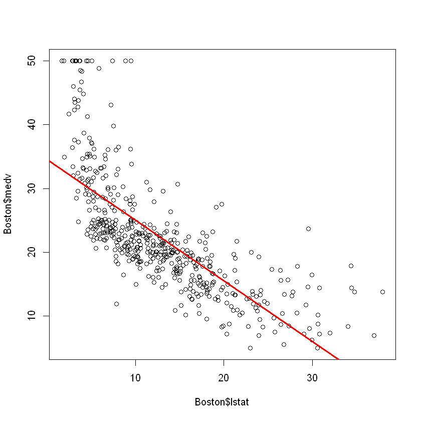


##### 使用ggplot2绘图


```R
Boston %>% 
  ggplot(aes(lstat, medv)) +
  geom_point() +
  geom_smooth(method = 'lm')
```


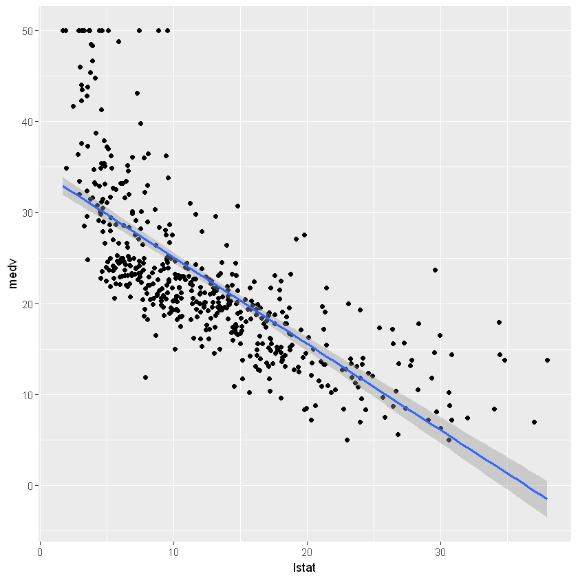


##### 计算残差并绘制散点图


```R
# 残差图
ggplot(NULL, aes(predict(simple.lm), residuals(simple.lm))) +
  geom_point() +
  geom_smooth() +
  labs(x = 'predicted value', y = 'residuals')
# 学生化残差图
ggplot(NULL, aes(predict(simple.lm), rstudent(simple.lm))) +
  geom_point() +
  geom_smooth() +
  labs(x = 'predicted value', y = 'studentized residuals')
```

    `geom_smooth()` using method = 'loess'
    


    `geom_smooth()` using method = 'loess'
    


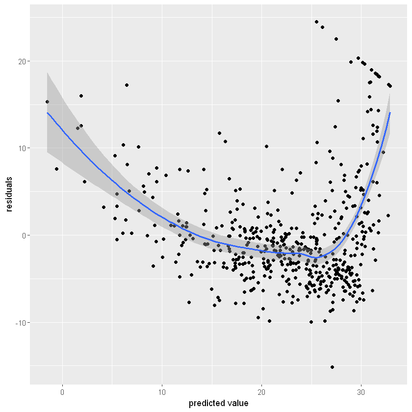


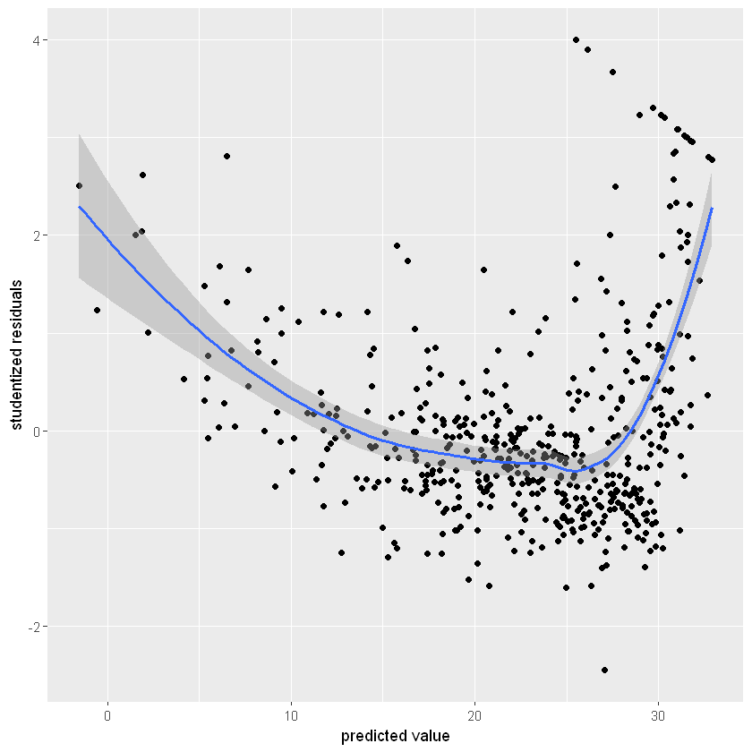


```R
# 模型拟合图汇总
par(mfrow = c(2, 2))
plot(simple.lm)
```


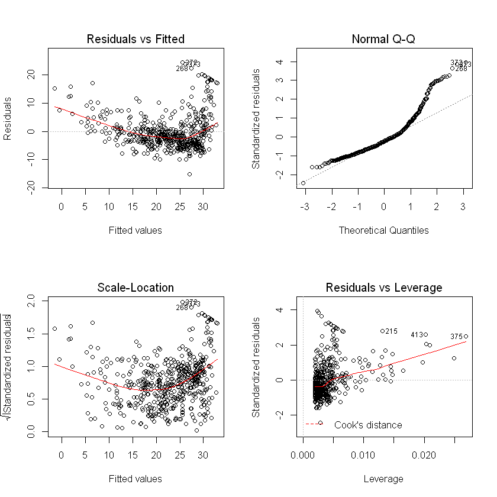


```R
# 杠杆统计量值
plot(hatvalues(simple.lm))
cat('最大杠杆统计量索引:', which.max(hatvalues(simple.lm)))
```

    最大杠杆统计量索引: 375


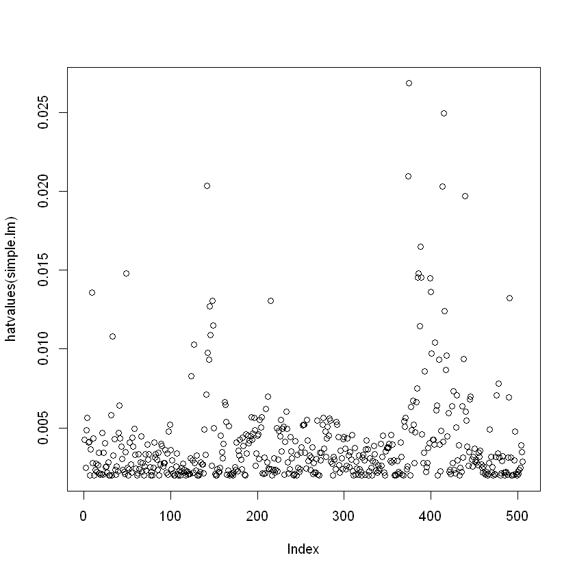


#### 多元线性回归


```R
mult.lm <- lm(medv ~ ., data = Boston)
mult.fit <- summary(mult.lm)
mult.fit
```


    
    Call:
    lm(formula = medv ~ ., data = Boston)
    
    Residuals:
        Min      1Q  Median      3Q     Max 
    -15.595  -2.730  -0.518   1.777  26.199 
    
    Coefficients:
                  Estimate Std. Error t value Pr(>|t|)    
    (Intercept)  3.646e+01  5.103e+00   7.144 3.28e-12 ***
    crim        -1.080e-01  3.286e-02  -3.287 0.001087 ** 
    zn           4.642e-02  1.373e-02   3.382 0.000778 ***
    indus        2.056e-02  6.150e-02   0.334 0.738288    
    chas         2.687e+00  8.616e-01   3.118 0.001925 ** 
    nox         -1.777e+01  3.820e+00  -4.651 4.25e-06 ***
    rm           3.810e+00  4.179e-01   9.116  < 2e-16 ***
    age          6.922e-04  1.321e-02   0.052 0.958229    
    dis         -1.476e+00  1.995e-01  -7.398 6.01e-13 ***
    rad          3.060e-01  6.635e-02   4.613 5.07e-06 ***
    tax         -1.233e-02  3.760e-03  -3.280 0.001112 ** 
    ptratio     -9.527e-01  1.308e-01  -7.283 1.31e-12 ***
    black        9.312e-03  2.686e-03   3.467 0.000573 ***
    lstat       -5.248e-01  5.072e-02 -10.347  < 2e-16 ***
    ---
    Signif. codes:  0 '***' 0.001 '**' 0.01 '*' 0.05 '.' 0.1 ' ' 1
    
    Residual standard error: 4.745 on 492 degrees of freedom
    Multiple R-squared:  0.7406,	Adjusted R-squared:  0.7338 
    F-statistic: 108.1 on 13 and 492 DF,  p-value: < 2.2e-16
    


```R
names(mult.fit)
```


<ol class=list-inline>
	<li>'call'</li>
	<li>'terms'</li>
	<li>'residuals'</li>
	<li>'coefficients'</li>
	<li>'aliased'</li>
	<li>'sigma'</li>
	<li>'df'</li>
	<li>'r.squared'</li>
	<li>'adj.r.squared'</li>
	<li>'fstatistic'</li>
	<li>'cov.unscaled'</li>
</ol>


```R
# 计算方差膨胀因子
car::vif(mult.lm)
```


<dl class=dl-horizontal>
	<dt>crim</dt>
		<dd>1.79219154743324</dd>
	<dt>zn</dt>
		<dd>2.29875817874944</dd>
	<dt>indus</dt>
		<dd>3.99159641834602</dd>
	<dt>chas</dt>
		<dd>1.07399532755379</dd>
	<dt>nox</dt>
		<dd>4.39371984757748</dd>
	<dt>rm</dt>
		<dd>1.93374443578326</dd>
	<dt>age</dt>
		<dd>3.10082551281533</dd>
	<dt>dis</dt>
		<dd>3.95594490637272</dd>
	<dt>rad</dt>
		<dd>7.48449633527445</dd>
	<dt>tax</dt>
		<dd>9.00855394759706</dd>
	<dt>ptratio</dt>
		<dd>1.79908404924889</dd>
	<dt>black</dt>
		<dd>1.34852107640637</dd>
	<dt>lstat</dt>
		<dd>2.94149107809193</dd>
</dl>


##### 去除age变量后回归


```R
mult.lm2 <- lm(medv ~ . -age, data = Boston)
(mult.fit2 <- summary(mult.lm2))
```


    
    Call:
    lm(formula = medv ~ . - age, data = Boston)
    
    Residuals:
         Min       1Q   Median       3Q      Max 
    -15.6054  -2.7313  -0.5188   1.7601  26.2243 
    
    Coefficients:
                  Estimate Std. Error t value Pr(>|t|)    
    (Intercept)  36.436927   5.080119   7.172 2.72e-12 ***
    crim         -0.108006   0.032832  -3.290 0.001075 ** 
    zn            0.046334   0.013613   3.404 0.000719 ***
    indus         0.020562   0.061433   0.335 0.737989    
    chas          2.689026   0.859598   3.128 0.001863 ** 
    nox         -17.713540   3.679308  -4.814 1.97e-06 ***
    rm            3.814394   0.408480   9.338  < 2e-16 ***
    dis          -1.478612   0.190611  -7.757 5.03e-14 ***
    rad           0.305786   0.066089   4.627 4.75e-06 ***
    tax          -0.012329   0.003755  -3.283 0.001099 ** 
    ptratio      -0.952211   0.130294  -7.308 1.10e-12 ***
    black         0.009321   0.002678   3.481 0.000544 ***
    lstat        -0.523852   0.047625 -10.999  < 2e-16 ***
    ---
    Signif. codes:  0 '***' 0.001 '**' 0.01 '*' 0.05 '.' 0.1 ' ' 1
    
    Residual standard error: 4.74 on 493 degrees of freedom
    Multiple R-squared:  0.7406,	Adjusted R-squared:  0.7343 
    F-statistic: 117.3 on 12 and 493 DF,  p-value: < 2.2e-16
    


```R
# 或者等价于
mult.lm22 <- update(mult.lm, ~.-age)
summary(mult.lm22)
```


    
    Call:
    lm(formula = medv ~ crim + zn + indus + chas + nox + rm + dis + 
        rad + tax + ptratio + black + lstat, data = Boston)
    
    Residuals:
         Min       1Q   Median       3Q      Max 
    -15.6054  -2.7313  -0.5188   1.7601  26.2243 
    
    Coefficients:
                  Estimate Std. Error t value Pr(>|t|)    
    (Intercept)  36.436927   5.080119   7.172 2.72e-12 ***
    crim         -0.108006   0.032832  -3.290 0.001075 ** 
    zn            0.046334   0.013613   3.404 0.000719 ***
    indus         0.020562   0.061433   0.335 0.737989    
    chas          2.689026   0.859598   3.128 0.001863 ** 
    nox         -17.713540   3.679308  -4.814 1.97e-06 ***
    rm            3.814394   0.408480   9.338  < 2e-16 ***
    dis          -1.478612   0.190611  -7.757 5.03e-14 ***
    rad           0.305786   0.066089   4.627 4.75e-06 ***
    tax          -0.012329   0.003755  -3.283 0.001099 ** 
    ptratio      -0.952211   0.130294  -7.308 1.10e-12 ***
    black         0.009321   0.002678   3.481 0.000544 ***
    lstat        -0.523852   0.047625 -10.999  < 2e-16 ***
    ---
    Signif. codes:  0 '***' 0.001 '**' 0.01 '*' 0.05 '.' 0.1 ' ' 1
    
    Residual standard error: 4.74 on 493 degrees of freedom
    Multiple R-squared:  0.7406,	Adjusted R-squared:  0.7343 
    F-statistic: 117.3 on 12 and 493 DF,  p-value: < 2.2e-16
    


#### 交互项
lstat:age表示将两者交互项加入方程，lstat*age表示将lstat，age和交互项加入方程。以下等价：
``` r
lm(medv ~ lstat * age, data = Boston)
lm(medv ~ lstat + age + lstat : age, data = Boston
```

#### 预测变量非线性变换
建立平方项：$I(X^2)$


```R
fit2 <- lm(medv ~ lstat + I(lstat ^ 2), data = Boston)
fit2 %>% summary
```


    
    Call:
    lm(formula = medv ~ lstat + I(lstat^2), data = Boston)
    
    Residuals:
         Min       1Q   Median       3Q      Max 
    -15.2834  -3.8313  -0.5295   2.3095  25.4148 
    
    Coefficients:
                 Estimate Std. Error t value Pr(>|t|)    
    (Intercept) 42.862007   0.872084   49.15   <2e-16 ***
    lstat       -2.332821   0.123803  -18.84   <2e-16 ***
    I(lstat^2)   0.043547   0.003745   11.63   <2e-16 ***
    ---
    Signif. codes:  0 '***' 0.001 '**' 0.01 '*' 0.05 '.' 0.1 ' ' 1
    
    Residual standard error: 5.524 on 503 degrees of freedom
    Multiple R-squared:  0.6407,	Adjusted R-squared:  0.6393 
    F-statistic: 448.5 on 2 and 503 DF,  p-value: < 2.2e-16
    


##### 比较两模型


```R
anova(lm(medv ~ lstat, data = Boston), fit2)
```


<table>
<thead><tr><th scope=col>Res.Df</th><th scope=col>RSS</th><th scope=col>Df</th><th scope=col>Sum of Sq</th><th scope=col>F</th><th scope=col>Pr(&gt;F)</th></tr></thead>
<tbody>
	<tr><td>504         </td><td>19472.38    </td><td>NA          </td><td>      NA    </td><td>      NA    </td><td>          NA</td></tr>
	<tr><td>503         </td><td>15347.24    </td><td> 1          </td><td>4125.138    </td><td>135.1998    </td><td>7.630116e-28</td></tr>
</tbody>
</table>


绘制残差图，残差规律很少


```R
par(mfrow = c(2, 2))
plot(fit2)
```


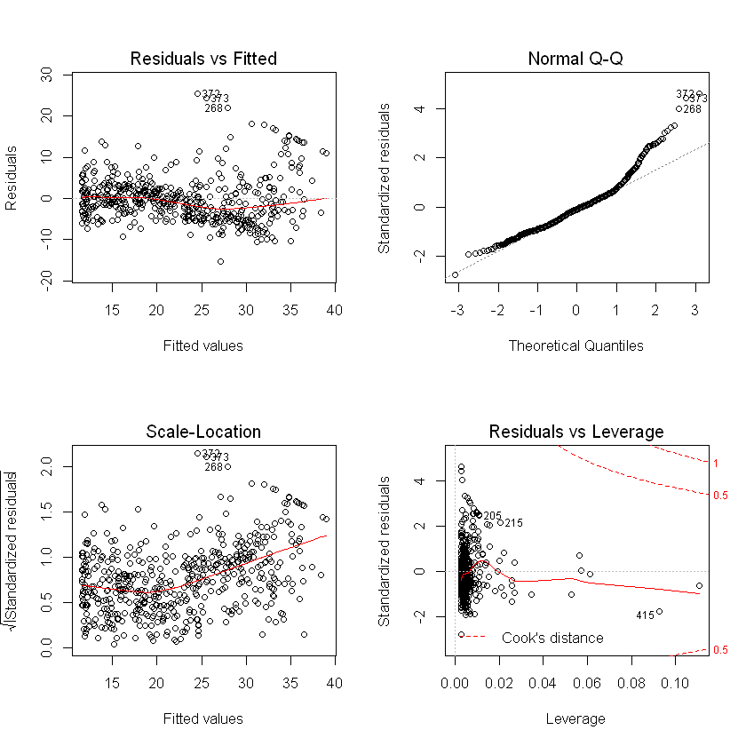


#### 定性预测变量

##### Carseats数据集
预测400个地区的Sales（儿童座椅销量），Shelveloc（每个地区搁架位置的质量指标），为分类的定性变量。


```R
Carseats <- ISLR::Carseats
head(Carseats)
```


<table>
<thead><tr><th scope=col>Sales</th><th scope=col>CompPrice</th><th scope=col>Income</th><th scope=col>Advertising</th><th scope=col>Population</th><th scope=col>Price</th><th scope=col>ShelveLoc</th><th scope=col>Age</th><th scope=col>Education</th><th scope=col>Urban</th><th scope=col>US</th></tr></thead>
<tbody>
	<tr><td> 9.50 </td><td>138   </td><td> 73   </td><td>11    </td><td>276   </td><td>120   </td><td>Bad   </td><td>42    </td><td>17    </td><td>Yes   </td><td>Yes   </td></tr>
	<tr><td>11.22 </td><td>111   </td><td> 48   </td><td>16    </td><td>260   </td><td> 83   </td><td>Good  </td><td>65    </td><td>10    </td><td>Yes   </td><td>Yes   </td></tr>
	<tr><td>10.06 </td><td>113   </td><td> 35   </td><td>10    </td><td>269   </td><td> 80   </td><td>Medium</td><td>59    </td><td>12    </td><td>Yes   </td><td>Yes   </td></tr>
	<tr><td> 7.40 </td><td>117   </td><td>100   </td><td> 4    </td><td>466   </td><td> 97   </td><td>Medium</td><td>55    </td><td>14    </td><td>Yes   </td><td>Yes   </td></tr>
	<tr><td> 4.15 </td><td>141   </td><td> 64   </td><td> 3    </td><td>340   </td><td>128   </td><td>Bad   </td><td>38    </td><td>13    </td><td>Yes   </td><td>No    </td></tr>
	<tr><td>10.81 </td><td>124   </td><td>113   </td><td>13    </td><td>501   </td><td> 72   </td><td>Bad   </td><td>78    </td><td>16    </td><td>No    </td><td>Yes   </td></tr>
</tbody>
</table>


```R
# 编码规则
contrasts(Carseats$ShelveLoc)
```


<table>
<thead><tr><th></th><th scope=col>Good</th><th scope=col>Medium</th></tr></thead>
<tbody>
	<tr><th scope=row>Bad</th><td>0</td><td>0</td></tr>
	<tr><th scope=row>Good</th><td>1</td><td>0</td></tr>
	<tr><th scope=row>Medium</th><td>0</td><td>1</td></tr>
</tbody>
</table>


```R
# 拟合交互项模型
lm(Sales ~ . + Income : Advertising + Price : Age, data = Carseats) %>% summary
```


    
    Call:
    lm(formula = Sales ~ . + Income:Advertising + Price:Age, data = Carseats)
    
    Residuals:
        Min      1Q  Median      3Q     Max 
    -2.9208 -0.7503  0.0177  0.6754  3.3413 
    
    Coefficients:
                         Estimate Std. Error t value Pr(>|t|)    
    (Intercept)         6.5755654  1.0087470   6.519 2.22e-10 ***
    CompPrice           0.0929371  0.0041183  22.567  < 2e-16 ***
    Income              0.0108940  0.0026044   4.183 3.57e-05 ***
    Advertising         0.0702462  0.0226091   3.107 0.002030 ** 
    Population          0.0001592  0.0003679   0.433 0.665330    
    Price              -0.1008064  0.0074399 -13.549  < 2e-16 ***
    ShelveLocGood       4.8486762  0.1528378  31.724  < 2e-16 ***
    ShelveLocMedium     1.9532620  0.1257682  15.531  < 2e-16 ***
    Age                -0.0579466  0.0159506  -3.633 0.000318 ***
    Education          -0.0208525  0.0196131  -1.063 0.288361    
    UrbanYes            0.1401597  0.1124019   1.247 0.213171    
    USYes              -0.1575571  0.1489234  -1.058 0.290729    
    Income:Advertising  0.0007510  0.0002784   2.698 0.007290 ** 
    Price:Age           0.0001068  0.0001333   0.801 0.423812    
    ---
    Signif. codes:  0 '***' 0.001 '**' 0.01 '*' 0.05 '.' 0.1 ' ' 1
    
    Residual standard error: 1.011 on 386 degrees of freedom
    Multiple R-squared:  0.8761,	Adjusted R-squared:  0.8719 
    F-statistic:   210 on 13 and 386 DF,  p-value: < 2.2e-16
    


## 3.7 习题

#### 第10题


```R
# 使用Population，Urban和US对Sales进行估计
lm(Sales ~ Population + Urban + US, data = Carseats) %>% summary
```


    
    Call:
    lm(formula = Sales ~ Population + Urban + US, data = Carseats)
    
    Residuals:
        Min      1Q  Median      3Q     Max 
    -7.3323 -1.9844 -0.0824  1.8783  8.4053 
    
    Coefficients:
                  Estimate Std. Error t value Pr(>|t|)    
    (Intercept)  6.7262086  0.4009409  16.776  < 2e-16 ***
    Population   0.0007415  0.0009499   0.781 0.435475    
    UrbanYes    -0.1341034  0.3063701  -0.438 0.661830    
    USYes        1.0360741  0.2921241   3.547 0.000437 ***
    ---
    Signif. codes:  0 '***' 0.001 '**' 0.01 '*' 0.05 '.' 0.1 ' ' 1
    
    Residual standard error: 2.787 on 396 degrees of freedom
    Multiple R-squared:  0.03342,	Adjusted R-squared:  0.02609 
    F-statistic: 4.563 on 3 and 396 DF,  p-value: 0.003713
    


把模型写成方程形式：
6.726 + 0.007415*Population {- 0.1341034 if Urban} {+ 1.0261 if US}


```R
# 简化模型
ex10.fit <- lm(Sales ~ US, data = Carseats)
ex10.fit %>% summary
```


    
    Call:
    lm(formula = Sales ~ US, data = Carseats)
    
    Residuals:
       Min     1Q Median     3Q    Max 
    -7.497 -1.929 -0.105  1.836  8.403 
    
    Coefficients:
                Estimate Std. Error t value Pr(>|t|)    
    (Intercept)   6.8230     0.2335   29.21  < 2e-16 ***
    USYes         1.0439     0.2908    3.59 0.000372 ***
    ---
    Signif. codes:  0 '***' 0.001 '**' 0.01 '*' 0.05 '.' 0.1 ' ' 1
    
    Residual standard error: 2.783 on 398 degrees of freedom
    Multiple R-squared:  0.03136,	Adjusted R-squared:  0.02893 
    F-statistic: 12.89 on 1 and 398 DF,  p-value: 0.0003723
    


```R
par(mfrow = c(2, 2))
plot(ex10.fit)
```


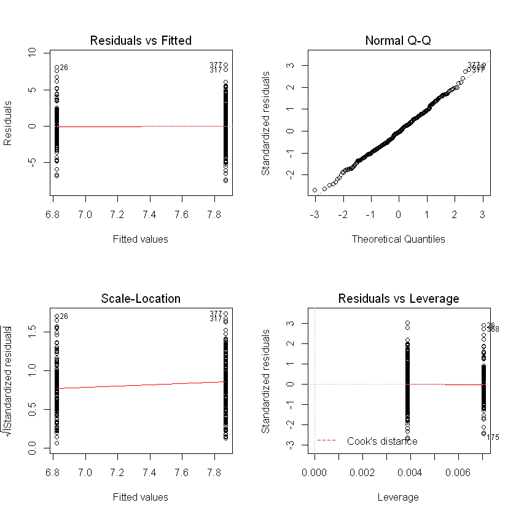


#### 第11题


```R
# 生成模拟数据
set.seed(1)
x <- rnorm(100)
y <- 2 * x + rnorm(100)
```


```R
ggplot(NULL, aes(x, y)) + geom_point()
```


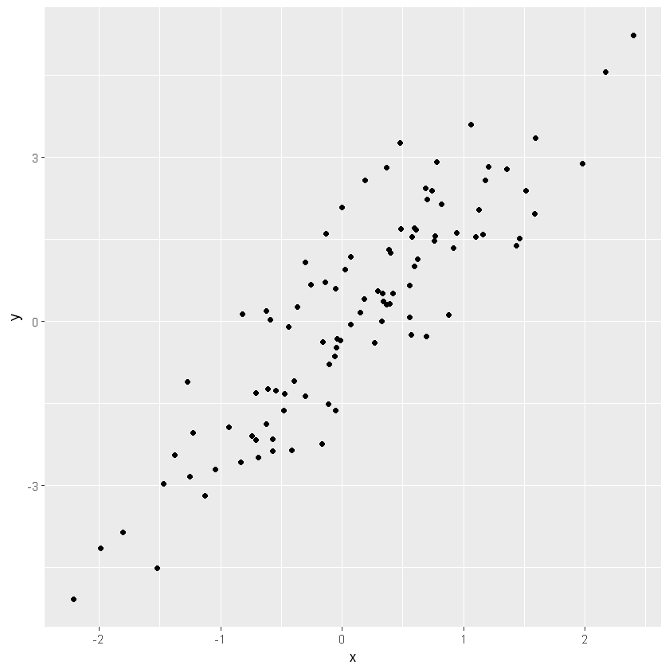


##### 建立不含截距的简单线性模型


```R
ex11.lm <- lm(y ~ x + 0)
summary(ex11.lm)
```


    
    Call:
    lm(formula = y ~ x + 0)
    
    Residuals:
        Min      1Q  Median      3Q     Max 
    -1.9154 -0.6472 -0.1771  0.5056  2.3109 
    
    Coefficients:
      Estimate Std. Error t value Pr(>|t|)    
    x   1.9939     0.1065   18.73   <2e-16 ***
    ---
    Signif. codes:  0 '***' 0.001 '**' 0.01 '*' 0.05 '.' 0.1 ' ' 1
    
    Residual standard error: 0.9586 on 99 degrees of freedom
    Multiple R-squared:  0.7798,	Adjusted R-squared:  0.7776 
    F-statistic: 350.7 on 1 and 99 DF,  p-value: < 2.2e-16
    


##### 将拟合直线添加到散点图


```R
ggplot(NULL, aes(x, y)) + geom_point() + geom_abline(slope = 1.9939, intercept = 0)
```


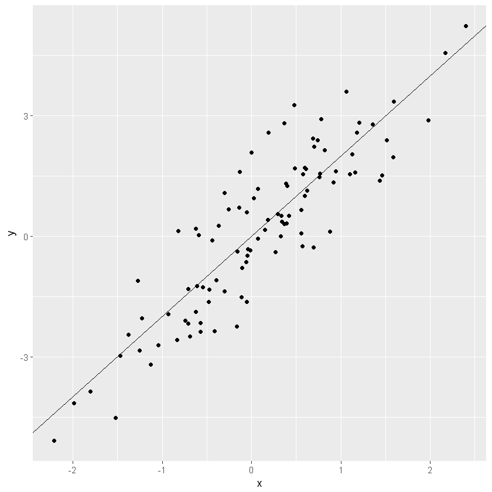


##### 建立x对y的无截距模型


```R
lm(x ~ y + 0) %>% summary
```


    
    Call:
    lm(formula = x ~ y + 0)
    
    Residuals:
        Min      1Q  Median      3Q     Max 
    -0.8699 -0.2368  0.1030  0.2858  0.8938 
    
    Coefficients:
      Estimate Std. Error t value Pr(>|t|)    
    y  0.39111    0.02089   18.73   <2e-16 ***
    ---
    Signif. codes:  0 '***' 0.001 '**' 0.01 '*' 0.05 '.' 0.1 ' ' 1
    
    Residual standard error: 0.4246 on 99 degrees of freedom
    Multiple R-squared:  0.7798,	Adjusted R-squared:  0.7776 
    F-statistic: 350.7 on 1 and 99 DF,  p-value: < 2.2e-16
    


两个模型t统计量相等，对于有截距模型，两者的t统计量依旧相等


```R
ex11.fit1 <- lm(y ~ x)
ex11.fit2 <- lm(x ~ y)
```


```R
summary(ex11.fit1)$coefficients
```


<table>
<thead><tr><th></th><th scope=col>Estimate</th><th scope=col>Std. Error</th><th scope=col>t value</th><th scope=col>Pr(&gt;|t|)</th></tr></thead>
<tbody>
	<tr><th scope=row>(Intercept)</th><td>-0.03769261 </td><td>0.09698729  </td><td>-0.3886346  </td><td>6.983896e-01</td></tr>
	<tr><th scope=row>x</th><td> 1.99893961 </td><td>0.10772703  </td><td>18.5555993  </td><td>7.723851e-34</td></tr>
</tbody>
</table>


```R
summary(ex11.fit2)$coefficients
```


<table>
<thead><tr><th></th><th scope=col>Estimate</th><th scope=col>Std. Error</th><th scope=col>t value</th><th scope=col>Pr(&gt;|t|)</th></tr></thead>
<tbody>
	<tr><th scope=row>(Intercept)</th><td>0.03880394  </td><td>0.04266144  </td><td> 0.9095787  </td><td>3.652764e-01</td></tr>
	<tr><th scope=row>y</th><td>0.38942451  </td><td>0.02098690  </td><td>18.5555993  </td><td>7.723851e-34</td></tr>
</tbody>
</table>


### 习题好多啊，未完待续。。。
